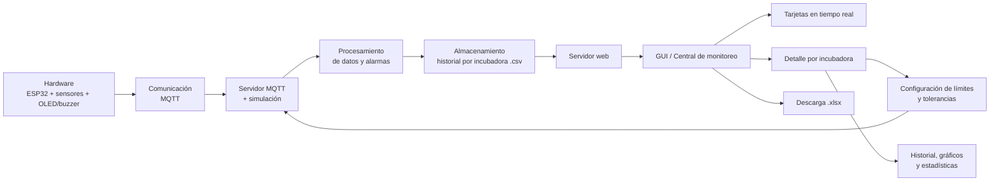

# Disposición Hardware
Este proyecto busca monitorear en tiempo real, y utilizando como controlador un módulo ESP32 de Arduino, variables ambientales de incubadoras neonatales. Para la ejecución del proyecto, cada incubadora deberá contar con una placa ubicada en el interior del compartimento del paciente y consistente en un módulo Arduino y los distintos sensores. Esta placa se conectará a otra colocada en el exterior del compartimento, consistente en un display OLED y un buzzer controlable mediante un pulsador.

# Interfaz Gráfica de Usuario
La información sensada (iluminancia, porcentaje de oxígeno, temperatura y humedad) y recopilada por cada módulo Arduino se envía a una interfaz gráfica de usuario (GUI) mediante protocolo MQTT. Esta interfaz muestra de manera simultánea y organizada en tarjetas correspondientes a cada incubadora, las variables sensadas en todas las incubadoras monitoreadas, de forma tal de funcionar como "central de monitoreo" de la sala de neonatología. Además de en la interfaz web, las mediciones realizadas por cada módulo pueden verse en tiempo real a través del display OLED ya mencionado. En caso de que alguno de las variables sensadas se salga de control, se emite tanto una alerta visual en la GUI como una alerta sonora mediante un buzzer controlado por el ESP32. En caso de que el controlador se desconecte, se emite una alerta visual en la GUI.

La interfaz de usuario permite, adicionalmente, ingresar a un monitoreo exhaustivo de cada incubadora conectada a la "central de monitoreo" al clickear sobre una tarjeta (una incubadora específica). Allí, el usuario puede setear, para la correspondiente incubadora, límites y tolerancias para cada uno de los parámetros ambientales sensados. Además, accediendo al monitoreo específico de cada variable, es posible visualizar un historial de alarmas y una tabla con estadísticas de dicha variable. Adicionalmente, se muestra un gráfico con la evolución temporal de la variable.

La versión actual colecta los datos captados por un único ESP32 y simula los datos provenientes de otros módulos Arduino. Las alertas disparadas tanto por el ESP32 como por la simulación se almacenan a nivel local en archivos .csv (un archivo por "incubadora"). Dichos archivos se actualizan constantemente y pueden ser descargados desde la misma GUI en formato de planilla de cálculo .xlsx. La planilla especifica qué columna pertenece a qué variable y muestra el histórico de todas las alarmas disparadas por la incubadora.

# Diagrama de flujo:

